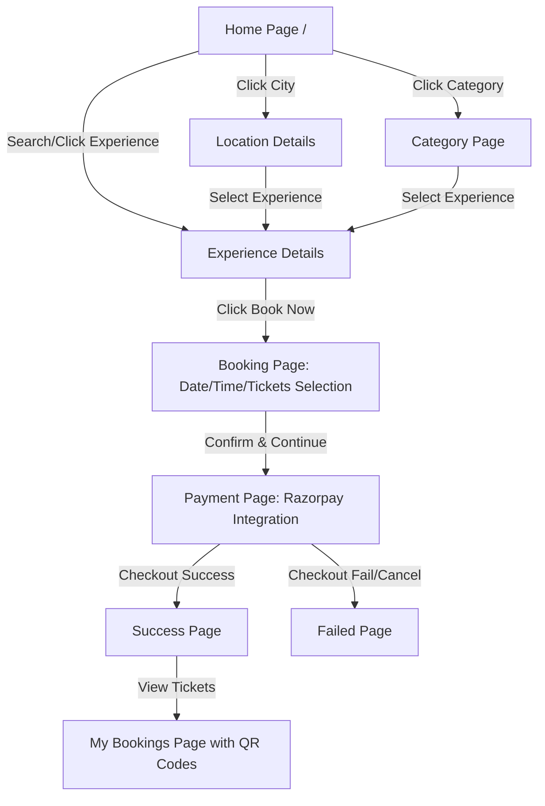

# SuperBookingApp Architecture & Workflow Guide

Welcome to the **SuperBookingApp** repository! This document serves as a developer guide to help you understand the tech stack, folder structures, database models, API routing, frontend pages, and the overall developer workflow.

---

## 🚀 Tech Stack Overview

| Component | Technology | Key Libraries/Tools |
| :--- | :--- | :--- |
| **Frontend** | React (Vite) | React Router DOM, Context API, TailwindCSS / Custom Styles |
| **Backend** | Python (Django) | Django REST Framework (DRF), SimpleJWT, SDKs (Razorpay, Firebase) |
| **Database** | PostgreSQL / SQLite | `psycopg2-binary` (PostgreSQL adapter), Django ORM |
| **Payments** | Razorpay | Razorpay API Integration, signature verification, webhooks |
| **Verification** | QR Codes | Python `qrcode` (Base64 QR generation for entry checking) |

---

## 📁 Repository Directory Structure

```text
SuperBookingApp/
├── backend/                  # Django Backend Application
│   ├── api/                  # Main REST API app (routing, views, serializers)
│   ├── authentication/       # JWT Auth and User signup/login
│   ├── backend/              # Django configurations and settings
│   │   └── settings/         # Modular settings (base.py, dev.py, prod.py)
│   ├── booking/              # Booking, Ticket, and Payment DB models
│   ├── content/              # Location, Category, and Experience DB models
│   ├── user/                 # Custom user profiles
│   ├── manage.py             # Django management CLI
│   └── requirements.txt      # Python dependencies
│
├── frontend/                 # React Frontend (Vite)
│   ├── src/
│   │   ├── api/              # API Client calls
│   │   ├── components/       # Reusable UI (Navbar, Footer, TicketCard, LoginModal)
│   │   ├── context/          # Global state (AuthContext, ModalContext)
│   │   ├── pages/            # App screens (Home, ExperienceDetails, BookingPage, etc.)
│   │   ├── services/         # Third-party service layers (Firebase)
│   │   └── App.jsx           # App routing & wrapper configurations
│   ├── vite.config.js        # Vite build tool config
│   └── package.json          # Node dependencies
│
└── workflow.md               # You are here!
```

---

## 🧠 Backend Architecture

The backend is built as a modular Django application exposing REST API endpoints via **Django REST Framework (DRF)**.

### 💾 1. Database Schema & Key Models
The database contains three main logical layers:

#### **Content Layer (`content/models.py`)**
*   **`Location`**: Cities or tourist destinations (e.g., Delhi, Jaipur). Contains name and an icon.
*   **`Category`**: Type of experience (e.g., Forts, Museums, Adventure).
*   **`Experience`**: The specific attraction or activity. Holds coordinates, description, entry fee base price, status, and maximum daily visitors capacity.
*   **`PricingRule`**: Handles dynamic prices (Adult, Child, Senior) for experiences, including seasonal price adjustments.
*   **`OperatingHours`**: Weekly opening/closing times and holiday/maintenance closures.

#### **Booking Layer (`booking/models.py`)**
*   **`Booking`**: Stores reference IDs, dates, ticket counts, pricing, and status (`pending`, `confirmed`, `cancelled`, `used`).
*   **`Ticket`**: Represents a single visitor's entry ticket. Generates a unique secure string converted to a **Base64 QR Code** image for digital verification at the gate.
*   **`Payment`**: Connects a Booking to a payment transaction, recording gateway details (Razorpay), status (`success`, `failed`), and timestamps.

---

### 🔌 2. Core API Endpoints (`backend/api/urls.py`)

Here are the primary endpoints used by the React frontend:

| Endpoint | Method | Description |
| :--- | :--- | :--- |
| `/api/home/` | `GET` | Fetches homepage banners, categories, and top monuments. |
| `/api/experiences/` | `GET` | Lists all available monuments/experiences. |
| `/api/experience/<public_id>` | `GET` | Retrieves detailed information, rules, and reviews of a monument. |
| `/api/experience/category/<category_name>/` | `GET` | Filters experiences by category. |
| `/api/location/` | `GET` | Lists all available locations. |
| `/api/booking/create/` | `POST` | Places a temporary ticket order (creates a booking). |
| `/api/payments/create/` | `POST` | Generates a Razorpay Order ID for checkout. |
| `/api/payments/verify/` | `POST` | Validates Razorpay checkout response signature to confirm payment. |
| `/api/bookings/` | `GET` | Lists current user's active & past tickets (including QR codes). |

---

## 🎨 Frontend Architecture (React)

The frontend is a modern SPA (Single Page Application) built using React, bundled with Vite, and routed using `react-router-dom`.

### 🧭 1. User Journey & Navigation Flow



### 📄 2. Core Page Component Mapping

*   **`Home.jsx`**: Feature banner slider, location circles, category filters, and grid list of recommended monuments.
*   **`ExperienceDetails.jsx`**: Large cover image, description, opening hours badge, ticket pricing breakdown, reviews/ratings section, and a primary CTA button to start booking.
*   **`BookingPage.jsx`**: Date picker (validates operating days), ticket quantity adjustments (Adult, Child, Senior) with real-time total amount calculations.
*   **`PaymentPage.jsx`**: Initiates Razorpay checkout SDK. Once processed, submits payment credentials to the backend for signature verification.
*   **`MyBookings.jsx`**: Displays a list of active and past bookings. Each active booking renders card-style tickets with scan-ready **QR Codes** retrieved from the backend.

---

## 🛠️ Local Development Setup

To run both services locally for testing:

### 1. Backend Setup
1.  Navigate to the `backend/` directory:
    ```bash
    cd backend
    ```
2.  Create and activate a virtual environment:
    ```bash
    python -m venv .venv
    # Windows:
    .venv\Scripts\activate
    # macOS/Linux:
    source .venv/bin/activate
    ```
3.  Install dependencies:
    ```bash
    pip install -r requirements.txt
    ```
4.  Configure database variables in a `.env` file (copied from `.env.example` if available).
5.  Run migrations and start the Django dev server:
    ```bash
    python manage.py migrate
    python manage.py runserver
    ```

### 2. Frontend Setup
1.  Navigate to the `frontend/` directory:
    ```bash
    cd ../frontend
    ```
2.  Install packages:
    ```bash
    npm install
    ```
3.  Configure API base URL in `src/config.js` or `.env`.
4.  Start Vite development server:
    ```bash
    npm run dev
    ```

---

## 🔄 Client Development Workflow (Git)

Since you are collaborating on a client repository, always follow the **Fork & Branch** workflow:

1.  **Sync Local with Client (`upstream`)**:
    ```bash
    git checkout main
    git fetch upstream
    git merge upstream/main
    ```
2.  **Create a New Feature Branch**:
    ```bash
    git checkout -b feature/your-feature-name
    ```
3.  **Make changes, commit, and push to your Fork (`origin`)**:
    ```bash
    git add .
    git commit -m "feat: describe the change clearly"
    git push origin feature/your-feature-name
    ```
4.  **Create a Pull Request (PR)** on GitHub from your fork `feature/your-feature-name` to the client's repository `main` branch.
